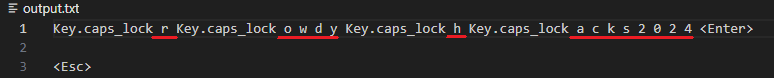

# Keylogger

## Introduction
The keylogger is designed to capture keystrokes on a machine. This application was created for expand our knowledge on different tools that are used and to have a better understanding on how they are made.

**Disclaimer:** This application is intended for educational purposes only. The use of this software for any malicious or unauthorized activities is strictly prohibited. The author(s) do not condone or support illegal activities

## Features
1. Captures keystrokes from the keyboard
2. Supports special keys and key combinations
3. Runs in the background with minimal visibility
4. Logs keystrokes to a designated output file

## Usage
1. Clone the repository or download the source code.
2. Compile and run the application on the target machine.
3. View the logged keystrokes in the designated output file.

## Screenshots

This screenshot shows the keystrokes captured when I typed in "RowdyHacks2024"

## Acknowledgements
- This Keylogger was created for RowdyHacks 2024 by Team Coderunner
